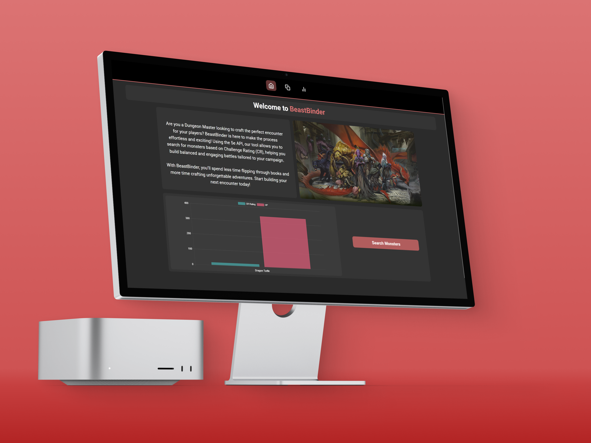

# BeastBinder – Formative One

> A Dungeons & Dragons 5e companion web app for searching, analysing, and comparing monsters.

<p align="center">
  
  
  
  
</p>

<p align="center">
  
  
  
  
</p>

---

## 2.1 Project Header

### Project title block

- **Name:** BeastBinder  
- **Type of digital solution:** Single Page Application (SPA)  
- **Primary purpose:** Help Dungeon Masters and players search, compare, and visualise D&D 5e monsters  
- **Author:** Keagan Boucher  

### Table of contents

1. [2.1 Project Header](#21-project-header)  
2. [2.2 About The Project](#22-about-the-project)  
3. [2.3 Getting Started](#23-getting-started)  
4. [2.4 Project Features](#24-project-features)  
5. [2.4 Development Process](#24-development-process)  
6. [2.5 Final Outcome](#25-final-outcome)  
7. [2.6 Conclusion](#26-conclusion)  
8. [2.7 Footer](#27-footer)

---

## 2.2 About The Project

### Short project description

BeastBinder is a React-based Dungeons & Dragons 5e companion app that helps Dungeon Masters and players quickly find, compare, and understand monsters. The app integrates with the public **D&D 5e API** to fetch real monster data and then presents it through a set of focused tools:

- A **search** experience for discovering monsters.  
- A **comparison page** for detailed side-by-side analysis.  
- An **enhanced comparison page** that visualises stats using charts.  
- A **recent monsters** list to keep your last encounters one click away.

The core goal is to reduce rulebook flipping and tab chaos, letting users focus on storytelling and encounter design while the app handles the numbers and structure.

### Built with

- **React** (SPA architecture and components)  
- **React Router** (client-side routing)  
- **Vite** (fast dev bundler and build tool)  
- **D&D 5e API** (live monster data)  
- **Chart.js** (radar, bar, and pie charts for monster stats)  
- **Axios** (HTTP requests)  
- **CSS / CSS Modules** (styling and layout)

### Core UI mockups

<p align="center">
  
  
</p>

<p align="center">
  
  
</p>

---

## 2.3 Getting Started

All repositories require installation instructions. This section explains how to clone and run the project locally for development and testing.

### Prerequisites

- Node.js 18 or higher  
- npm or yarn  
- A modern browser that supports ES6+  

BeastBinder consumes the public **D&D 5e API**, so no backend or database setup is required for this project.

### How to install

1. **Clone the repository**

   ```bash
   git clone https://github.com/KeaganCB-OW/Formative-One-BeastBinder.git
   cd Formative-One-BeastBinder/beastbinder-app
   ```

2. **Install dependencies**

   ```bash
   npm install
   ```

3. **Run the development server**

   ```bash
   npm run dev
   ```

   Vite will start a development server (usually at `http://localhost:5173/`). The terminal will show the exact URL.

4. **Build for production**

   To create an optimized build for deployment:

   ```bash
   npm run build
   ```

   This generates a `dist/` folder with minified assets ready for hosting on any static site provider (e.g. Netlify, Vercel, GitHub Pages).

---

## 2.4 Project Features

### Main features and functionality

#### Monster search

- Search for monsters from the **D&D 5e API** using a responsive search interface.  
- Dynamically filtered results update as the user types.  
- Monster entries show key information such as name and challenge rating (CR).  
- Selecting a monster updates other parts of the interface (e.g. comparison data or detail panels).

#### Comparison page

- Compare two monsters side by side on a dedicated **Comparison Page**.  
- Display key stats such as HP, AC, size, type, CR, vulnerabilities, resistances, and immunities.  
- Designed to answer quick questions like “which of these is tankier?” or “which one has more weaknesses?”.

#### Enhanced comparison page

- Visualise monster stats using **Chart.js**:  
  - Radar chart for core attributes or combat stats.  
  - Bar charts for comparing specific numeric fields.  
  - Pie / doughnut charts for HP share or other proportional data.  
- Helps users quickly interpret differences at a glance rather than reading tables of numbers.

#### Recent monsters

- Recently viewed monsters are stored in **localStorage**.  
- Users can quickly revisit commonly used monsters without searching again.  
- This supports real table use, where DMs often reuse the same creatures during a session.

#### Navigation and UX

- **React Router** provides smooth navigation between pages (Search, Comparison, Enhanced Comparison, Timeline).  
- Breadcrumbs help users understand where they are (e.g. navigating from Comparison to Timeline).  
- Responsive layout allows use on laptop screens as well as smaller displays.


## 2.4 Development Process

This section documents the design and technical decisions made while building BeastBinder.

### Component architecture

- The app is structured as a **component-based SPA**:  
  - Reusable components for monster search, result lists, comparison blocks, and chart wrappers.  
  - Page-level components for the **Comparison Page**, **Enhanced Comparison Page**, and **Timeline Page**.  
- This structure keeps the UI scalable and makes it easier to extend features like adding a second comparison slot or more advanced filters.

### API integration (D&D 5e API)

- BeastBinder retrieves monster lists and details from the **D&D 5e API**.  
- Axios handles HTTP requests and error states are managed in the UI when a monster cannot be found.  
- Responses are normalised into shapes that work cleanly with both the comparison components and chart components.

### Data visualisation (Chart.js)

- **Chart.js** is used to generate radar, bar, and pie charts for key monster stats.  
- The app maps numeric fields (such as HP, AC, attributes, or CR) into chart datasets.  
- Charts are themed to match the overall app styling and kept simple to remain readable during a game session.

### Routing and state management

- **React Router** manages navigation between main pages.  
- Shared state for selected monsters and recently viewed monsters is handled through props and/or simple context (depending on the component).  
- This avoids the overhead of a full global state manager while still keeping data consistent across pages.

### Styling and layout

- Layout is handled with responsive CSS, using flexbox/grid where appropriate.  
- Styles are organised into dedicated CSS or CSS Module files aligned with components and pages.  
- Visual design focuses on readability (clear typography, strong contrast) so that users can glance at stats quickly.

---

## 2.5 Final Outcome

### Demonstration video

Example placeholder:

- [BeastBinder walkthrough – demo video](https://drive.google.com/file/d/1FQRfC_PAkw0EzYWjQs9ADd-vB8PJPNJr/view?usp=sharing)


## 2.6 Conclusion

BeastBinder explores how a focused utility app can support tabletop roleplaying by turning raw D&D 5e monster data into an interactive, visual experience. The project demonstrates how to combine **API integration**, **data visualisation**, and **component-based UI design** to make complex information more accessible for players and Dungeon Masters.

Building the app highlighted a few key learnings:

- Structuring data around the UI’s needs is just as important as calling the API.  
- Visualisations (charts) can quickly communicate differences that would be tedious to read in plain text.  
- Even without a custom backend, thoughtful front-end architecture (routing, components, local storage) can create a powerful experience.

Future iterations could introduce features like encounter building, exportable stat blocks, user accounts to save favourite monsters, or even AI assisted suggestions for encounter difficulty based on party level.

---

## 2.7 Footer

### License

This project is licensed under the **MIT License**.  
See the `LICENSE` file in this repository for the full license text and usage terms.

### Author

**Keagan Boucher**  

- GitHub: [KeaganCB-OW](https://github.com/KeaganCB-OW)  
- LinkedIn: [Keagan Boucher](https://www.linkedin.com/in/keagan-boucher-0a5820353/)

### Acknowledgements

- The creators and maintainers of the **D&D 5e API**.  
- The wider D&D community for inspiring the concept and use cases.  
- Lecturers and peers who provided feedback during the formative project review.
